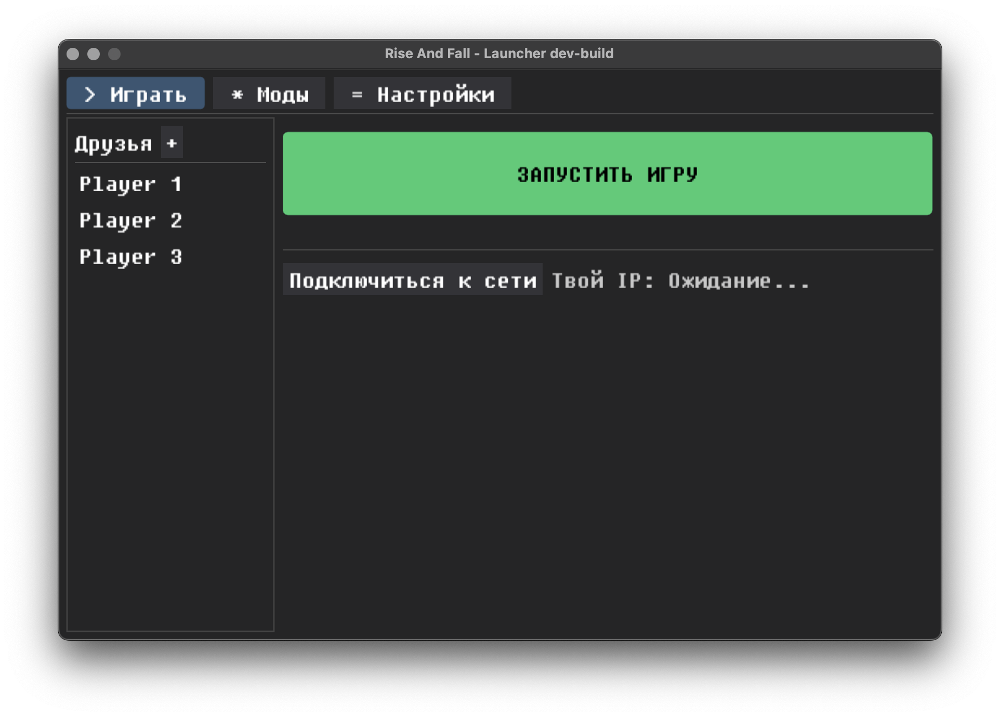

<div align="center">

# ⚔️ Rise And Fall Game Launcher

[Русский](#русская-версия) | [English](#english-version)

<br>


=3.13-3776AB?style=for-the-badge&logo=python&logoColor=white" alt="Python">

<br>


<br>
<br>



</div>

## <a id="русская-версия"></a>Русская версия


### 🎮 О проекте
**Raf-launcher** — это современный кастомный лаунчер, созданный специально для игры **Rise and Fall: Civilizations at War**. Он решает главные проблемы онлайн игры: упрощает подключение по локальной сети, позволяет мгновенно делиться сохранениями с друзьями и удобно устанавливать модификации (например, GFM-raf) всего в пару кликов.

### ✨ Текущий функционал
* 🚀 **Прямой запуск игры:** Автоматический запуск с нужными аргументами (`-datapath`, `-redistpath`).
* 🌐 **Интеграция с ZeroTier:** Лаунчер сам проверяет, устанавливает и подключается к нужной сети ZT, а также выводит твой виртуальный IP-адрес прямо в интерфейсе.
* 💾 **Умная передача сохранений:** Встроенный P2P-сервер на базе FastAPI. Лаунчер сам находит твои сохранения за текущий день, архивирует их и отправляет другу по сети одним кликом.
* 🛠 **Менеджер модов:** Скачивание и точечная распаковка архивов с модами.
* 👥 **Список друзей:** Сохранение IP-адресов друзей, быстрое копирование IP в буфер обмена по левому клику и отправка сохранений по правому.

### 💻 Как запустить (Для разработчиков)
Проект использует сверхбыстрый пакетный менеджер `uv`.

1. Установите [uv](https://github.com/astral-sh/uv).
2. Склонируйте репозиторий и перейдите в папку проекта.
3. Синхронизируйте зависимости (это автоматически создаст виртуальное окружение):
   ```bash
   uv sync
   ```
4. Запустите лаунчер:
   ```bash
   uv run start
   ```

### 📦 Сборка проекта (.exe)
Проект настроен на автоматическую сборку через **GitHub Actions**. При пуше в ветку `features/enhancements` или создании Pull Request'а в `develop`, GitHub сам соберет `Raf-Launcher.exe` и прикрепит его в виде артефакта к экшену.

Если вы хотите собрать проект локально вручную:
```bash
uv run pyinstaller --noconfirm --onefile --windowed --name "Raf-Launcher" --add-data "assets;assets" --add-data "pyproject.toml;." --paths "src" src/main.py
```

---

## <a id="english-version"></a>English Version

### 🎮 About the Project
**Raf-launcher** is a modern, custom-built launcher specifically designed for the game **Rise and Fall: Civilizations at War**. It solves the main pain points of multiplayer by streamlining LAN connections, enabling instant save-game sharing between friends, and providing an easy 1-click installation for game modifications (like GFM-raf).

### ✨ Current Features
* 🚀 **Direct Game Launching:** Automatically launches the game with the required arguments (`-datapath`, `-redistpath`).
* 🌐 **ZeroTier Integration:** Auto-installs the client, connects to the designated network, and displays your virtual IP address directly in the UI.
* 💾 **Smart Save Sync:** Built-in P2P FastAPI server. Automatically locates today's save files, archives them, and sends them directly to a friend over the network with a single click.
* 🛠 **Mod Manager:** Downloads and extracts mod archives directly into the game folder.
* 👥 **Friends List:** Saves friends' IP addresses for quick transfers. Left-click to copy IP to clipboard, right-click to send saves.

### 💻 How to Run (Development)
This project uses the blazing-fast package manager `uv`.

1. Install [uv](https://github.com/astral-sh/uv).
2. Clone the repository and navigate to the project directory.
3. Sync dependencies (this will automatically create a virtual environment):
   ```bash
   uv sync
   ```
4. Start the launcher:
   ```bash
   uv run start
   ```

### 📦 How to Build (.exe)
This project is configured for automated builds via **GitHub Actions**. Upon pushing to the `features/enhancements` branch or creating a Pull Request to `develop`, GitHub will automatically build `Raf-Launcher.exe` and attach it as an artifact.

If you want to build the project locally:
```bash
uv run pyinstaller --noconfirm --onefile --windowed --name "Raf-Launcher" --add-data "assets;assets" --add-data "pyproject.toml;." --paths "src" src/main.py
```
