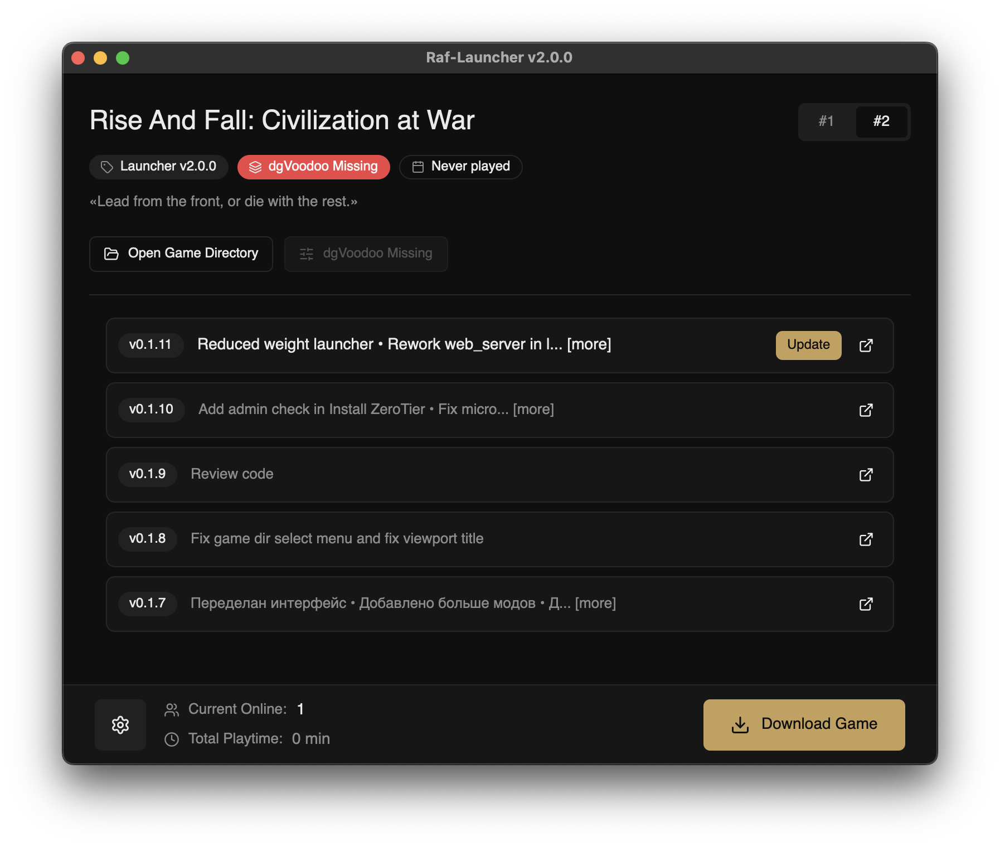

<div align="center">

# Rise & Fall Launcher ⚔️

**Next-generation, high-performance desktop launcher & profile manager for Rise & Fall: Civilizations at War.**

*Rise & Fall Launcher is an unofficial, community-driven open-source project.<br>
Not affiliated with, endorsed by, or connected to Midway Games, Stainless Steel Studios, or any of their subsidiaries.*

</div>

<p align="center">
  <a href="https://github.com/kotop21/RiseAndFall---launcher/actions">
    
  </a>
  <a href="#community--language-policy">
    
  </a>
  <a href="https://bun.sh/">
    
  </a>
  <a href="https://react.dev/">
    
  </a>
  <a href="https://go.dev/">
    
  </a>
  <a href="https://www.docker.com/">
    
  </a>
  <a href="LICENSE">
    
  </a>
</p>

---

<p align="center">
  
</p>

---

## ⚡ Core Features

- 🚀 **GPU-Accelerated Native GUI:** Built upon `@gpuix/react` and Bun, compiled to a compact standalone Windows executable using the Deno v8 engine with zero runtime overhead and rapid startup.
- 🎮 **Automated Game Installer & DirectX Setup:** Single-click streaming installation with chunk verification, automated archive extraction, and integrated **dgVoodoo2** DirectX wrapper for smooth rendering on modern GPUs.
- 🛠️ **Native Go Settings Engine (`raf-settings.exe`):** High-speed companion CLI built in Go 1.23 that interfaces directly with the Windows Registry (`HKCU\Software\Midway Home Entertainment\Rise and Fall`) for automated sanitization, export, and import of game configurations.
- 🧩 **Multi-Profile Management & Playtime Tracking:** 5 isolated profile slots allowing instant switching of resolution, launch arguments, and mods, paired with persistent playtime tracking and session history.
- 🔄 **Non-Intrusive Self-Updater:** Background release polling via GitHub Releases API, unobtrusive toast notifications on new updates, and atomic binary replacement without interrupting gameplay.
- 🐳 **Containerized Cross-Platform Build System:** Fully automated build pipeline managed by `build.py` and `Dockerfile`, allowing developers on Linux, macOS, or Windows to compile Windows binaries consistently via Docker.
- 🎧 **Discord Rich Presence:** Real-time presence reporting game status, match state, and elapsed play duration to your Discord profile.

---

## 📥 Installation & Downloads

### Stable Releases
Grab the latest release package from the **[GitHub Releases](https://github.com/kotop21/RiseAndFall---launcher/releases)** page:
1. Download `RiseAndFall-launcher_v<VERSION>.zip`.
2. Extract the archive into any preferred directory.
3. Run `raf-launcher.exe`.

### Bleeding-Edge Dev Builds
Every commit pushed to the `develop` branch automatically compiles development binaries with developer console logging enabled:
- Head to **[GitHub Actions (Develop Pipeline)](https://github.com/kotop21/RiseAndFall---launcher/actions?query=branch%3Adevelop)**.
- Select the latest successful workflow run and download the `raf-launcher-windows-dev-x64` artifact.

---

## 🛠️ Building from Source

### Prerequisites
Ensure the following tools are installed on your workstation:
- **[Bun](https://bun.sh/)** `>= 1.2` (JavaScript runtime, package manager & test runner)
- **[Go](https://go.dev/)** `>= 1.23` (Required to compile `packages/raf-settings`)
- **[Docker](https://www.docker.com/)** (Recommended for cross-compiling via container)
- **[Python 3](https://www.python.org/)** (Required to run the build orchestrator `build.py`)
- **[Deno](https://deno.land/)** `Canary` (Optional, only required if compiling directly on host without Docker)

### 1. Clone Repository
```bash
git clone https://github.com/kotop21/RiseAndFall---launcher.git
cd RiseAndFall---launcher
```

### 2. Install Dependencies
```bash
bun install
```

### 3. Build Go Settings CLI
```bash
cd packages/raf-settings
go build -ldflags="-s -w" -o raf-settings.exe .
cd ../..

# Place binary into launcher runtime directory
mkdir -p dist/bin
cp packages/raf-settings/raf-settings.exe dist/bin/
```

### 4. Run in Development Mode
Launch the application with live reload and developer console enabled:
```bash
bun run dev
```

### 5. Run Typechecks & Tests
Execute the comprehensive test suite (68+ tests, logging silenced automatically):
```bash
# Run tests and TypeScript verification in one command
bun run prebuild

# Run test suite only
bun test
```

### 6. Compiling Windows Executable

#### Method A: Automated Containerized Build via Docker & Python (Recommended)
The project includes a unified build orchestrator ([`build.py`](build.py)) and Docker environment ([`Dockerfile`](Dockerfile)). This approach ensures a reproducible environment by running Deno Canary v8 inside a container without needing Deno installed on your host machine:

```bash
# Development build (console terminal enabled)
bun run build
# Or directly via Python:
python3 build.py

# Production release build (no console window)
RELEASE=1 bun run build
# Or directly via Python:
RELEASE=1 python3 build.py
```

**What `build.py` does automatically:**
1. Validates Docker daemon availability.
2. Checks and fetches the `@gpuix` Windows native addon (`gpuix-native.win32-x64-msvc.node`) from npm if absent.
3. Injects `API_URL` configuration from `.env` or process environment.
4. Generates version metadata via `bun run scripts/generate-version.js`.
5. Bundles React/TS into `dist/build/` and prepends N-API runtime glue (`scripts/runtime-napi.js`).
6. Builds the Docker builder image from `Dockerfile` and compiles `raf-launcher.exe` using Deno Canary v8.
7. Outputs ready-to-run artifacts in `dist/`.

#### Method B: Direct Host Compilation (Without Docker)
If you are running on Windows and have Deno Canary installed natively:
```bash
# 1. Generate version metadata
bun run scripts/generate-version.js

# 2. Bundle source code with Bun
bun build index.tsx --outdir dist/build --target node \
  --external @gpuix/native-darwin-arm64 \
  --external @gpuix/native-darwin-universal

# 3. Prepend N-API runtime glue
cat scripts/runtime-napi.js dist/build/index.js > dist/build/bundle.js

# 4. Compile standalone Windows binary via Deno (Release Mode)
deno compile \
  --allow-all \
  --no-check \
  --no-npm \
  --no-terminal \
  --target x86_64-pc-windows-msvc \
  --engine v8 \
  --icon assets/icon.ico \
  --output dist/raf-launcher.exe \
  dist/build/bundle.js

# 5. Copy Windows native addon
cp node_modules/@gpuix/native-win32-x64-msvc/gpuix-native.win32-x64-msvc.node dist/
```

---

## 🏛️ Technical Architecture & Project Structure

| Directory / File | Description |
| :--- | :--- |
| [`app/`](app/) | Top-level application layout (`App.tsx`) and orchestrated view controllers (`MainView`, `SettingsView`, `InstallView`, `WelcomeView`). |
| [`components/`](components/) | Modular, decoupled UI components partitioned by domain (`settings/`, `install/`, `main/`, `welcome/`, `ui/`, `icon/`). |
| [`lib/`](lib/) | Core domain services: binary updater, config persistence, process management, Windows registry client, error handling, and logger. |
| [`packages/raf-settings/`](packages/raf-settings/) | Go 1.23 CLI binary source for Windows Registry configuration export, import, and sanitization. |
| [`build.py`](build.py) | Python build orchestrator executed via `bun run build`. Coordinates Docker builds, N-API injection, and binary compilation. |
| [`Dockerfile`](Dockerfile) | Debian-based Docker container setup with Deno Canary v8 for cross-compiling the standalone Windows binary. |
| [`lang/`](lang/) | Localization dictionaries supporting English (`en.json`), Ukrainian (`ua.json`), and Russian (`ru.json`). |
| [`scripts/`](scripts/) | Automation scripts for runtime version generation (`generate-version.js`) and N-API bootstrapping (`runtime-napi.js`). |
| [`test/`](test/) | Comprehensive `bun:test` test suites covering config migrations, updater logic, registry CLI discovery, and error normalization. |
| [`assets/`](assets/) | Application branding, icons, light/dark logos, and interface preview captures. |
| [`.github/workflows/`](.github/workflows/) | GitHub Actions CI/CD pipelines (`dev.yml`, `main.yml`, `release.yml`). |

---

## 🌐 Community & Language Policy

To maintain clear and efficient collaboration, this project enforces a strict language policy:

> [!IMPORTANT]
> **Official Project Communication Languages: English (EN) and Ukrainian (UA).**
> - All GitHub Issues, Pull Requests, Discussions, commit messages, and review comments **must be written exclusively in English or Ukrainian**.
> - Submissions in other languages will be politely requested to be translated or may be closed without review.

Join our community and follow updates:
- **Bug Reports & Feature Requests:** [GitHub Issues](https://github.com/kotop21/RiseAndFall---launcher/issues)
- **Discussions & Feedback:** [GitHub Discussions](https://github.com/kotop21/RiseAndFall---launcher/discussions)

---

## 📄 License & Legal Notice

This project is licensed under the **[GNU Affero General Public License v3.0 (AGPL-3.0)](LICENSE)**.

- **Source Code:** You are free to inspect, modify, and redistribute this software under the terms of the AGPLv3.
- **Game Assets & Trademarks:** *Rise & Fall: Civilizations at War* and related names, logos, and game assets are trademarks and copyright of Midway Home Entertainment, Stainless Steel Studios, and their respective owners. This project is a non-commercial, fan-made utility designed to enhance compatibility and user experience on modern computing platforms.
